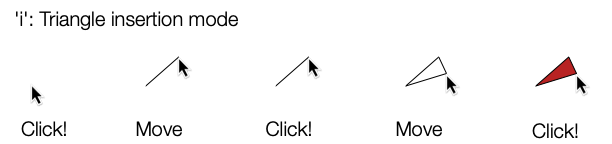
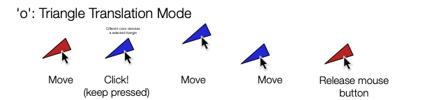
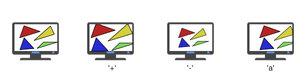

# CS-GY 6533 A – Interactive Computer Graphics - Fall 2021

# Assignment 2: 2D Triangle Editor and Rasterization

Handout date: 09/30/2021

Submission deadline: 10/14/2021, 11:59PM EST

Demo date: TBA, via Zoom appointments

This assignment accounts for 20% of your final grade. 

## Goals

In this exercise you will implement a 2D editor for vector graphics. The editor will allow to draw simple shapes interactively.

## GLM

In all exercises you will need to do operations with vectors and matrices. To simplify the code, you will use GLM:

* https://glm.g-truc.net/0.9.9/index.html

Have a look at the Getting Started page of GLM as well as the Code Samples page to acquaintain yourselves with the basic vector and matrix operations supported:

* https://github.com/g-truc/glm/blob/master/manual.md#section1

* https://github.com/g-truc/glm/blob/master/manual.md#section8

## OpenGL

In all exercises you will use OpenGL 3.3 with GLSL version 150 (You can use a newer version if you want).

## Submission

Try to maintain the same directory organization as the starter code, so you don't need to change the CMakeLists.txt file.

* Follow this to accept assignment and create repository: 

```bash
https://classroom.github.com/a/6WKxDqa3
```

* You must use the source code provided for Assignment 2 in the class repository. Don't forget to initialize and update the submodules: 

```bash
git submodule update --init --recursive https://github.com/nyu-cs-gy-6533-fall-2020/base 
```

* Modify the provided code following the assignment instructions.

* Add a report in markdown format that contains what you did with a screenshot for each task.

* Commit and push the code into the repository before the deadline.

## Mandatory Tasks (Task 1)

For each tasks below, add at least one image in the readme demonstrating the results. The code that you used for all tasks should be provided.

## Triangle Soup Editor (Task 1.1)

Implement an interactive application that allows to add, edit, and delete triangles. The following operations should be supported:

* The key 'i' will enable triangle insertion mode. When this mode is enabled, every triple of subsequent mouse clicks will create a triangle connecting the three locations where the mouse has been pressed. The first click will create the starting point of the segment, which will be immediately visualized. As the mouse is moved, a preview of a segment will appear. After the second mouse click, a preview of the triangle will appear. After the third click, the current preview will transform into the final triangle. 



* The key 'o' will enable triangle translation mode. Each mouse click will selected the triangle below the cursor (which will be highlighted), and every movement of the mouse (while keeping the button pressed) will result in a corresponding translation of the triangle. Note that the triangle should move on screen by the same amount as the cursor.



* The key 'p' will enable delete mode. When the mouse is pressed, the triangle below the cursor is deleted.

## Rotation/Scale (Task 1.2)

When triangle translation mode is enabled, keep the current primitive selected after the mouse is released. If a primitive is selected and you press the keys 'h' and 'j', the triangle will rotate by 10 degree clockwise or counter-clockwise, respectively. The rotations should be done around its barycenter, i.e. the barycenter of the triangle should not change. When the keys 'k' or 'l' are pressed, the primitive should be scaled up or down by 25%. Similarly to before, the barycenter of the triangle should not move due to the scaling. For this task, you can directly edit the position of the vertices of the triangles on the CPU side, and re-upload them to the GPU after every change. If you do it directly in the vertex shader, you can gain additional points (see optional Task 2 below).

## Colors (Task 1.3)

Add the possibility to paint the color of each vertex in the scene. Color mode is enabled by the key 'c'. In this mode, every mouse click will select the vertex closer to the current mouse position. After a vertex is selected, pressing a key from '1' to '9' will change its color (the colors that you use are not important, you can pick whatever colors you like). The color should be interpolated linearly inside the triangles.

## View Control (Task 1.4)

Add to the application the capability of changing the camera. The following actions should be supported:

* '+' should increase the zoom by 20% zooming in in the center of the screen

* '-' should decrease the zoom by 20% zooming out in the center of the screen

* 'w', 'a', 's', and 'd' should pan the view by 20% of the visible part of the scene, i.e. translate the entire scene, respectively down, right, up and left by 20% of the window size.

This should NOT be implemented by changing the coordinates of the objects in the scene. You MUST add a view matrix to the vertex shader (as a uniform) that is transforming the position of the vertices of the triangles before they are rendered. Note that you will also have to transform the screen coordinates using the inverse of the view matrix, to ensure that the user interaction will adapt to the current view.



## Add keyframing (Task 1.5)

Add the possibility to keyframe one property of an object (size,  position, or rotation) and create an animation using linear interpolation between the keyframes. You can use a timer to make the animation automatic, or you could move to the next frame at the press of a button.

## Optional Task

This task is optional, and it worths 5% of the final grade.

## Shader translation/scaling/rotation (Task 2)

Upload every single triangle as a separate primitive in a separate VBO (or in a single VBO using offsets for drawing them one by one). For each primitive, upload to the GPU its model matrix (as a uniform) that transforms the triangle from its canonical position (defined at its creation) to the current position (obtained by combining translations, scaling and rotations). The transformation should be executed in the shader, and the content of the VBO storing the vertex positions never updated.
