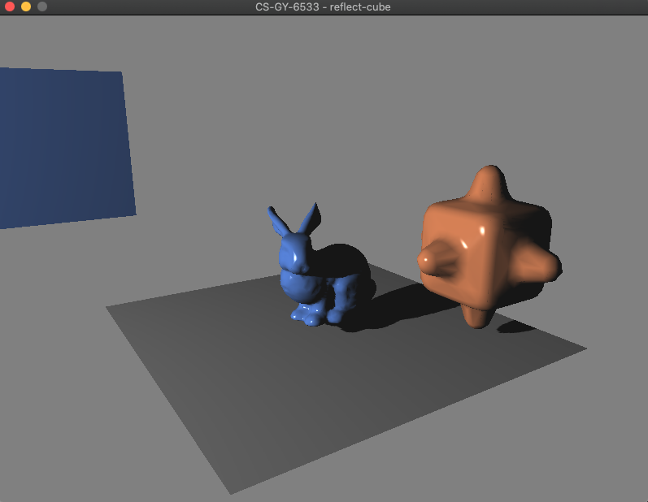
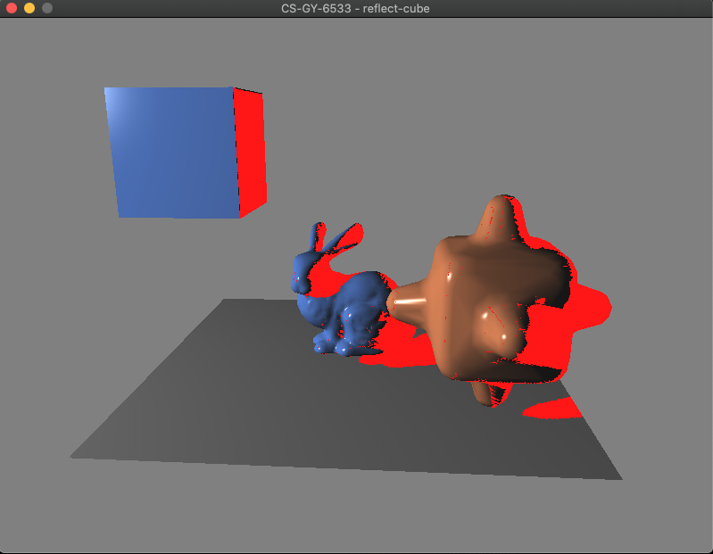
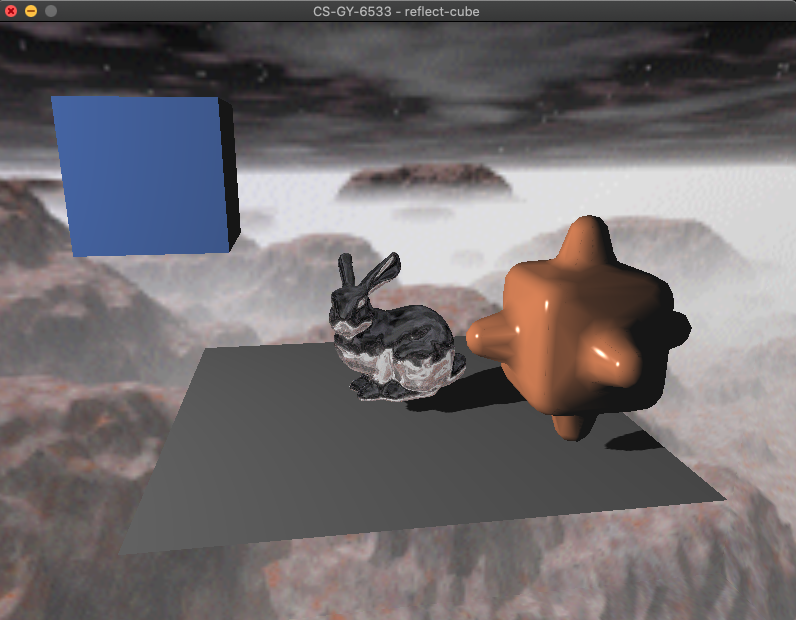
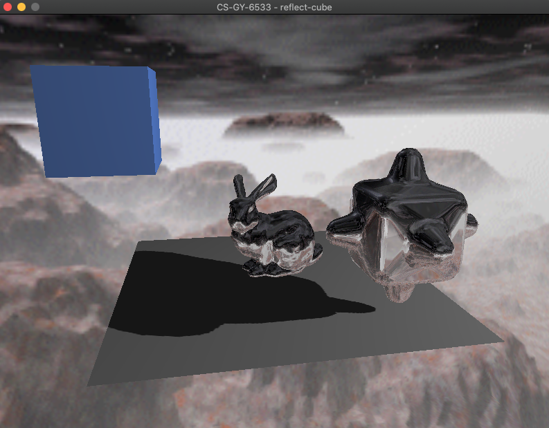

# CS-GY 6533 A – Interactive Computer Graphics - Fall 2021

# Assignment 4: Environment Mapping and Shadow Mapping

Handout date: 11/10/2021

Submission deadline: 11/30/2021, 11:59PM EST

Demo date: TBA, via Zoom appointments

This assignment accounts for 30% of your final grade. 

## Goals

This homework will improve the 3D scene editor from the previous assignment, adding shadow and reflection effects.

## GLM

In all exercises you will need to do operations with vectors and matrices. To simplify the code, you will use GLM:

* https://glm.g-truc.net/0.9.9/index.html

Have a look at the Getting Started page of GLM as well as the Code Samples page to acquaintain yourselves with the basic vector and matrix operations supported:

* https://github.com/g-truc/glm/blob/master/manual.md#section1

* https://github.com/g-truc/glm/blob/master/manual.md#section8

## OpenGL

In all exercises you will use OpenGL 3.3 with GLSL version 150 (You can use a newer version if you want).

## Submission

Try to maintain the same directory organization as the starter code, so you don't need to change the CMakeLists.txt file.

* Follow this to accept assignment and create repository: 

```bash
https://classroom.github.com/a/BAGWJR7K
```

* You MUST use the source code provided for Assignment 2 and the code you implemented for Assignment 3 following this assignment instructions. Don't forget to initialize and update the submodules: 

```bash
git submodule update --init --recursive https://github.com/nyu-cs-gy-6533-fall-2020/base 
```

* Modify the provided code following the assignment instructions.

* Add a report in markdown format that contains what you did with a screenshot for each task.

* Commit and push the code into the repository before the deadline.

## Mandatory Tasks

For each task below, add at least one image in the readme demonstrating the results. The code that you used for all tasks should be provided.


## Shadow Mapping

Starting with the interactive application you have implemented in the previous assignment, add shadows to the scene to increase its realism. You will still need to be able to add, select and move, and delete 3D meshes to the scene (they can be added in randomly at any position in the scene; otherwise, the center of the scene).

The scene should always contain one light source (you can add more light sources if you want, but that will require multiple depth maps). The light source should be placed on top of the scene and move around the scene's objects in a circular path (imagine you are in the center of a room, and the light source moves around you at the top of your head).

New objects can be added to the scene in three ways:

* The key '1' will add a unit cube in the origin

* The key '2' will import a new copy of the mesh 'bumpy_cube.off', scale it to fit into a unit cube and center it on the origin

* The key '3' will import a new copy the mesh 'bunny.off', scale it to fit into a unit cube and center it on the origin

Note that you can have multiple copies of the same object in the scene, and each copy can have its position, scale, and rotation. All objects (besides the reflective ones) must be shaded using the Phong Shading (per-fragment shading) and Phong's lighting model.

The shadow's color must interchangeably change colors from back to red and vice-versa when the user hits the key 's' (see figures below).  In order to easily visualize the shadows, you must render a plane below the objects in the scene (see figure below).

|  |
|:--:|
| <b>The picture shows the mesh objects and plane rendered using per-fragment shading and the shadow mapping algorithm.</b> |


|  |
|:--:|
| <b>The picture shows the mesh objects and plane rendered using per-fragment shading and the shadow mapping algorithm. In this version, the shadows are displayed using the red color.</b> |

Don't forget to consult the class textbook and the optional and recommended text. The OpenGL Programming Guide has a full section on shadow mapping. It is explained in detail how to set up the depth buffer for using a shadow mapping algorithm and the matrices transformations needed.

## Environment Mapping

In this task, you must implement the environment mapping technique discussed in class.
Using the cube map textures provided in the data folder into the assignment directory in GitHub, you must create the cube skybox and correctly load the textures in OpenGL (remember the axis directions). 

You can convert the images to an image format you already can handle (PPM) (for instance, using GIMP) or use any other image library to load the data from the disk. In the case you use an external library, you must provide the code for the library, the changes in the CMake configurations, and be sure it compiles on Linux with no issues.

The easiest way to accomplish this task is to start adding the skybox cube, validating that you correctly loaded the cube map textures, and then write the vertex and fragment shaders to handle the reflection direction calculation and texture sampling.

When an object is selected, it should be possible to translate it, rotate it around its barycenter, and rescale it without changing its barycenter. All these actions should be associated to keyboard keys (and the choice of keys should be detailed in the readme).

Each object also has a rendering setting associated with it, which can be one of the following two options:

* Phong Shading: the normals are specified on the vertices of the mesh and interpolated in the interior. The lighting equation should be evaluated for each fragment.

* Mirror (chrome) appearance: the object is rendered using the environment mapping technique discussed in class. In this item, you don't need to update the cube map texture at each iteration.


|  |
|:--:|
| <b>Skybox (cube with textures) and reflective objects rendered using the environment mapping technique.</b> |


|  |
|:--:|
| <b>Multiple objects can be rendered as reflective ones.</b> |

## Camera Control

Add the possibility to translate the position of the camera (similarly to the previous assignment). The camera should always point to the origin. It should be possible to move it around, but the camera should always face the origin.

Implement only the perspective camera. The cameras should take into account the size of the window, properly adapting the aspect ratio to not distort the image whenever the window is resized. All functionalities should work after resizing the window, including object selection and editing of the scene.

## Optional Tasks

These tasks are optional.

## Refraction

This task is optional and worth 1% of the final grade.
The calculation of the reflection vector can be easily changed to the calculation of the refraction vector. 
Add to your system the refractive material property for the objects. Once it is implemented, you will be able to render transparent objects.

## Dynamically Generated Cube Map Textures

This task is optional and worth 3% of the final grade.

As discussed in class, the cube map textures can be generated on the fly. This technique allows us to render objects with time-dependent reflections, i.e., all objects in the scene will be displayed in the cube map textures. As a result, the reflection color values on a reflective object's surface will change with time.  This technique adds a performance hit in the final total rendering time. Why is that?

